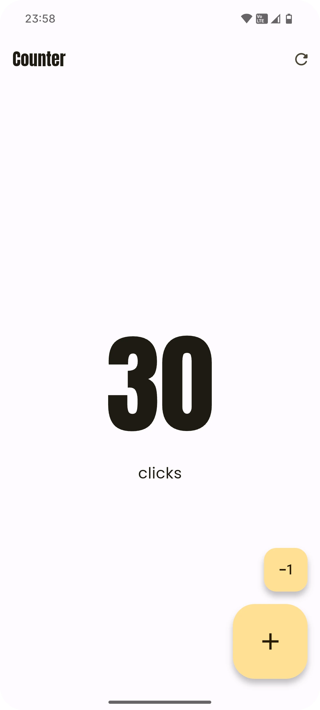

# 🚀 Flutter Counter App 🧮

A simple and elegant counter application built with Flutter, showcasing a clean and modern user interface. This project serves as a practical example for those learning Flutter and demonstrates the use of key widgets, state management, and basic UI design principles.

## ✨ Features

- 🔢 **Simple Counter Logic:** Increment, decrement, and reset the counter value.
- 🖼️ **Dynamic UI:** The UI adapts to the current state of the counter.
- 📳 **Haptic Feedback:** Provides a tactile response on button taps for a better user experience.
- 🔊 **Sound Effects:** Plays a click sound on each interaction.
- 🎨 **Adaptive Colors:** Uses dynamic_color to adapt to the user's system color scheme (Material You on - Android 12+).
- 🧩 **Custom Buttons:** A reusable CustomButton widget demonstrates modular and clean code practices.
- 🧑‍🎨 **Material 3:** Designed with the latest Material Design guidelines for a contemporary look and feel.



## 🚦 Getting Started

To run this project, make sure you have Flutter installed on your machine.

1. Clone the repository: 📥

```shell
git clone https://github.com/juliannGabrielDev/counter_app_flutter.git
```

2. Navigate to the project directory: 📂

```shell
cd counter_app_flutter
```

3. Get the dependencies: 📦

```shell
flutter pub get
```

4. Run the app: ▶️

```shell
flutter run
```

## 📚 Resources

- 📖 [Flutter official documentation](https://docs.flutter.dev/)
- 🌈 [Dynamic Color package](https://pub.dev/packages/dynamic_color)
- 🖋️ [Google Fonts package](https://pub.dev/packages/google_fonts)
